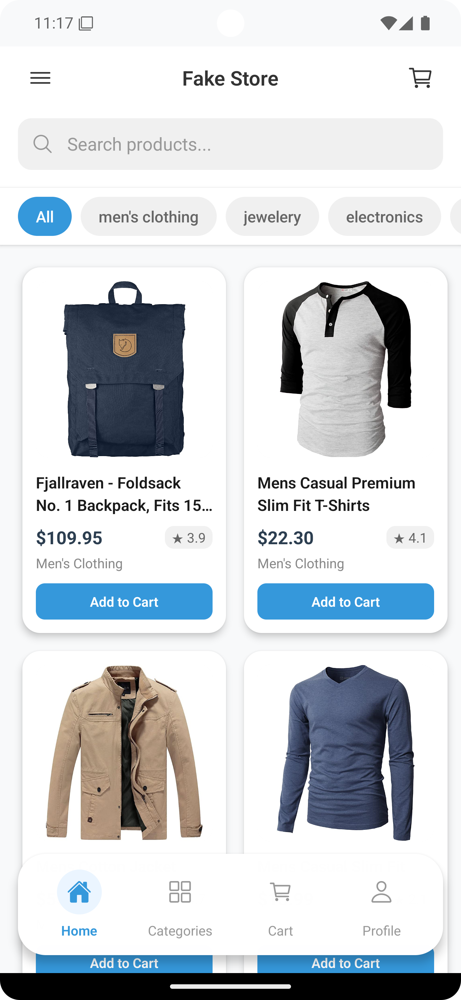
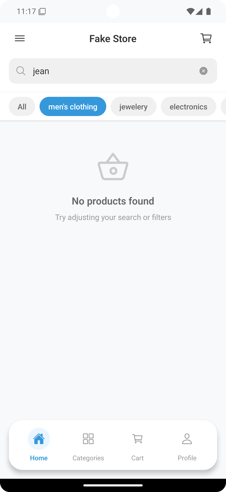
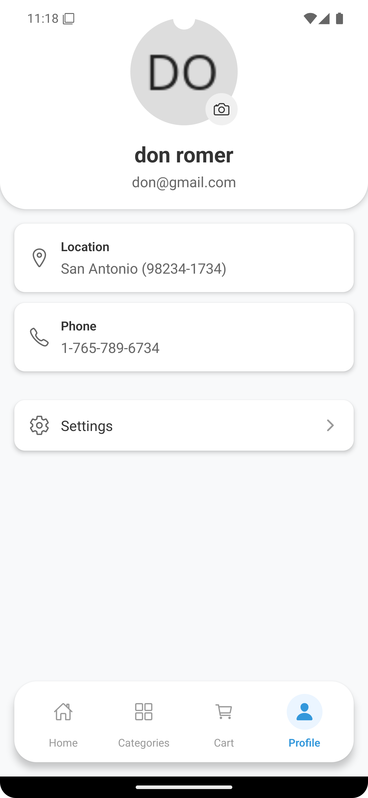

# Fake Store

A modern e-commerce app built with React Native and Expo.

## Getting Started

```bash
# Install dependencies
npm install

# Start the app
npx expo start
```

## Features

- User authentication
- Product browsing and search
- Shopping cart management
- Dark mode support
- Modern UI design

## Tech Stack

- React Native
- Expo
- TypeScript
- Zustand
- NativeWind

## Screenshots

| Splash | Login | Signup |
|:-:|:-:|:-:|
|  |  |  |

| Home | Search | Profile |
|:-:|:-:|:-:|
|  |  |  |
